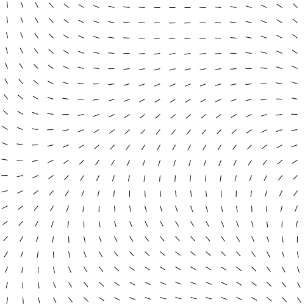

A flow field is a grid of vectors, we call this vector field. It essentially defines a path. And it is one of my favorite techniques for creating generative art.

## What is Flow (Vector) Field
A vector field is basically a function $V$ that assigns each point $(x,y)$ to the vector $\vec{S}$. In physics, it helps to visualize and understand gravitation
and electromagnetism. But in this article, we are not interested in those.

If we think about mathematics, we can define a vector field function like this:

$$
\vec{V}(x,y) = P(x,y)\hat{i} + Q(x,y)\hat{j}
$$

In programming, I divide flow fields into two parts. Parametric flow fields, and non-parametric flow fields.

Parametric flow fields are fields that can be described using mathematical functions, such as $sin$, $cos$ etc. Non-parametric flow fields are opposite of above.
One and probably the most popular example could be a noise field. We will discuss (and create) both flow fields later on.

## Creating Flow Field
Creating flow field is same for all programming languages. I am using TypeScript and p5.js library in this article. You can use your preferred programming language
and library. It doesn't matter as long as you understand the logic behind.

Generally, both parametric and non-parametric flow fields are created using floating point numbers in $[0,1]$ range. But we need vectors. So how do we convert these
numbers to vectors, by using angles.

Basically we need a function that takes a number and returns a angle. Since I am using p5.js, there is a beautiful function called `map()` in p5. Full function
definition is something like this;

```ts
map(value, oldMin, oldMax, newMin, newMax) => number;
```

For example calling `map(0.5, 0, 1, 0, 360)` returns `180`. It changes value's range.

Now, we have all the background for creating a flow field. Let's start by creating parametric flow fields.

### Parametric Flow Field
So, we need a function. For sake of simplicity I am going to use my beloved $sin$ function. To be exact, I am going to use $V(x,y)=sin(x)+cos(y)$. If you noticed,
this function is not returning vector, it returns a scalar. That is because we want to create a vector from this function by using `map`.

Let's start coding by creating a TypeScript file and creating flow field function.

```ts
function f(x: number, y: number): number {
  return sin(x)+cos(y);
}
```

We don't actually want a function like that because of it's range. $sin$ and $cos$ functions has range $[-1,1]$. Adding these two ranges yields $[-1,1]+[-1,1]=[-2,2]$.
If we divide this range by 2, then we would have $[-1,1]$ which is great for out function. So let's change out `f` function.

```ts
function f(x: number, y: number): number {
  return (sin(x)+cos(y)) * 0.5;
}
```

Since we want to convert this number to angle, we also need to map this result to range $[0, 2\pi]$.

```ts
function f(x: number, y: number): number {
  const value = (sin(x)+cos(y)) * 0.5;
  return map(value, -1, 1, 0, TWO_PI);
}
```

So, this is our parametric flow field function. Now we can visualize to see how it looks like. For simplicity, I am going to use lines to visualize.

Let's start by creating some p5.js functions.

```ts
function setup() {
  createCanvas(500, 500);
  background(255);
  noLoop();
}

function draw() {

}
```

To not burn my computer, I am also going to create a constant called `RESOLUTION`. This will be used while getting numbers for our flow field. Let's start by filling
our draw function.

```ts
function draw() {
  for(let x = RESOLUTION / 2; x < width; x += RESOLUTION) {
    for(let y = RESOLUTION / 2; y < height; y += RESOLUTION) {
      const angle = f(x, y);
      line(x, y, 10 * cos(angle), 10 * sin(angle));
    }
  }
}
```

These `for` loops are self explanatory, we are just looping through every grid cell. Inside both loops, we are calling flow field function with current x and y positions.
Remember, this function returns a radian. Radians are useful because polar coordinates are great for angles. We also can convert from polar coordinate to cartesian
coordinate system easily.

`cos(angle)` means we want angle's projection to x axes. Meaning that it returns x value of point.
`sin(angle)` is the same thing but returns y value of point.

We are multiplying these conversions by 10 (or any number) in order to change it's length. If we run this code, we should see something like this.



### Non-parametric Flow Field
