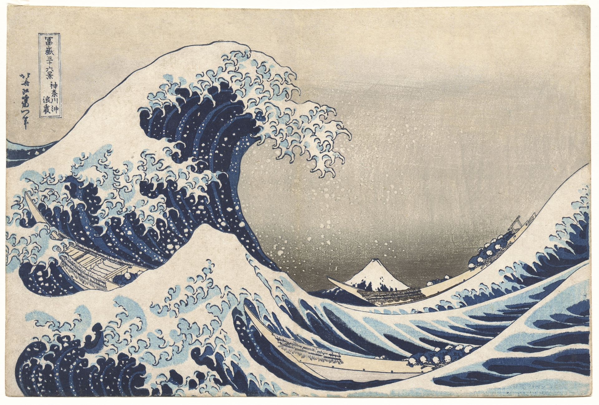
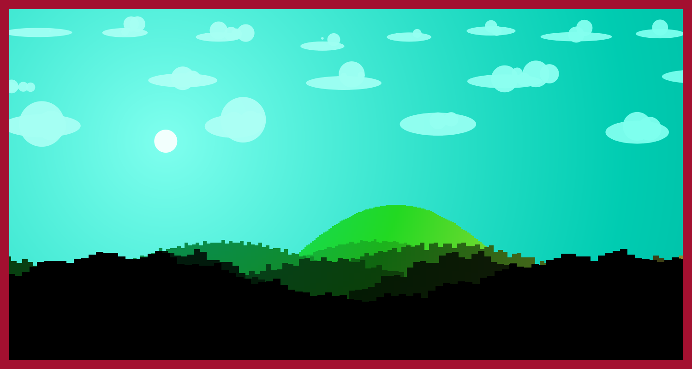
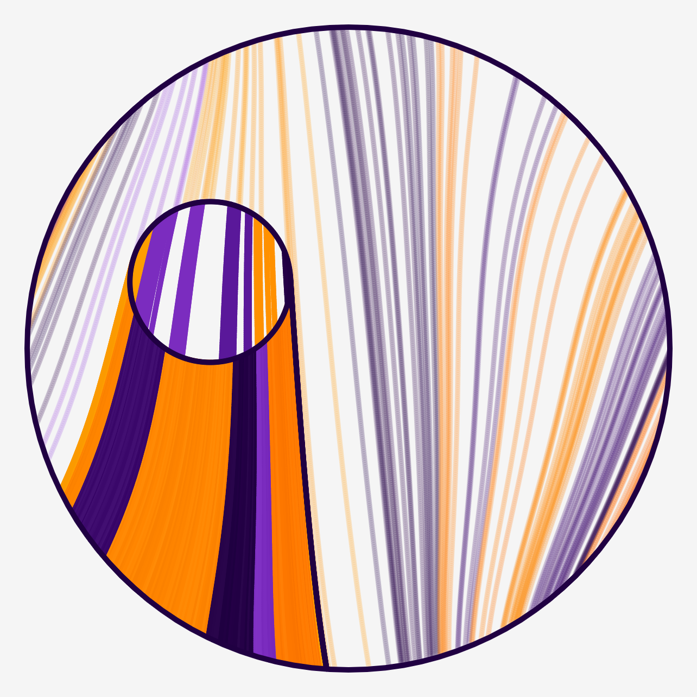

I started creating generative art in late 2021. But I can't stop doing it. It's really fun (for me) and I can feel that it develops my imagination and creativity.

In this post, I will try to explain what is generative art and how I do it. Without further a do let's start by defining generative art.

## What is Generative Art
Basically generative art is combining code and art. At least this is how I define it. It's made up of rules, bunch of rules to be exact. Then you have to transcribe
those rules to code and the computer does the rest.

## Creating Generative Art
First of all, creating generative art requires a thought process and some inspiration. You have to imagine what you want to do. I always start with finding some
references and images that can be created using code. Then I try to find what rules can I extract from that image. These rules generally have some parameters I can tweak.
These parameters are what makes a generative art. Changing parameters sometimes yields so different image and sometimes yields little differences. I will explain
these rules and parameters later on.

While analyzing the reference image, I came up with some ideas that I can apply to my generative art. For a really basic example, if I see square, I always think
what shape can replace that square. A triangle, circle, rectangle, hexagon? These replacements, additions are essential for generative art. These things makes
your generative art more diverse. Diversity is also really important factor when creating generative art.

After analyzing and finding out what I want to do, I start coding. After coding phase is done, most important phase comes in. Tweaking parameters.

Tweaking parameters and making them balanced in your generative art is really important. Because you have to know limits of your parameters. For example creating
a square can take three parameters. Size, color and position. Making position fully random can cause some problems (square can go offscreen etc.). To prevent square
go offscreen we have to set some limits. While determining square's position we can pass some arguments to `random()` function. These arguments (generally minimum and maximum)
are that parameter's limits.

If you are new to this, don't push your limits. I mean, don't start with something that looks really hard (like creating 3D face mesh from scratch?).
I'm speaking from experience, please don't. Because I did that mistake and I, don't want to say wasted but, wasted my two month for something like this.

Then I give up and created this piece, my first generative art, Landscapes.

I know it looks like child drawn (especially the clouds) but I still like it. I also put so much time to this piece because that times generative art was also new to me.

Anyways, this is basically my process of generating generative art. Some people may do it different but in the end we are all creating generative art.

### Rules and Parameters
Rules and parameters are essential when creating generative art. You may ask, what is a rule? Let me explain.

Rule is basically a pattern, at least how I imagine it. Let's try to extract some rules from my generative art Trails.

I want to give some context before analyzing the image. When I started coding this generative art, I've thinked about a circle leaving trails while it moves. And I
wanted to see the trails of other circles. There are no other circle but I wanted to express that idea by drawing saturated lines.

Let's start to analyze the image. When I first look at this image, I can see that it consists of two layers, background and foreground. Also it looks like background
is masked with a circle.

I also can see that the background has some lines, flow field lines to be exact, and background lines are more saturated than foreground lines. Then, foreground lines
are looks like follows the same flow field from the background, but more vivid. If you look at inner circle, we can see that lines in the inner circle also follows the
same flow field.

As you can see, while analyzing the image we destructured the image. We find out that the image has two layers and a flow field. In background, flow field lines are
more saturated than foreground flow field lines. Also foreground flow field lines are more dense.

These things could look like not a rule to you but essentially we found out how to approach creating something like this.

1. Initialize a flow field
2. Draw background
    1. Draw saturated lines (background)
3. Draw foreground
    1. Draw inner circle
    2. Draw trails of inner circle
4. Mask it

In the end, rules helps us to draw a roadmap. Let's move on to parameters.

Parameters are variables. For Trails above, we can parameterize some things. For example density of background lines, inner circle's size, mask's size etc. Adjusting
these parameters makes your generative art balanced. Think about it, if we make inner circle too small what would happen. Foreground trails would be thin and would not
stand out, there would be more saturated lines and in the end artwork would be more saturated look. What happens when we increase the density or saturation of background
lines. Again, foreground trails would not stand out.

So, tweaking those parameters and finding the sweet spot can take up some time but it definitely will pay out.

## Conclusion
So there you have it. I tried my best to explain generative art and my thought process to you.

Hopefully this article helped you about understanding generative art and thought process. I will definitely try to continue write posts about generative art, techniques and
post-mortems of my generative arts.

Until next time and thanks for reading.