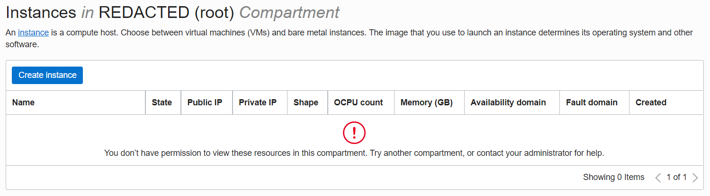
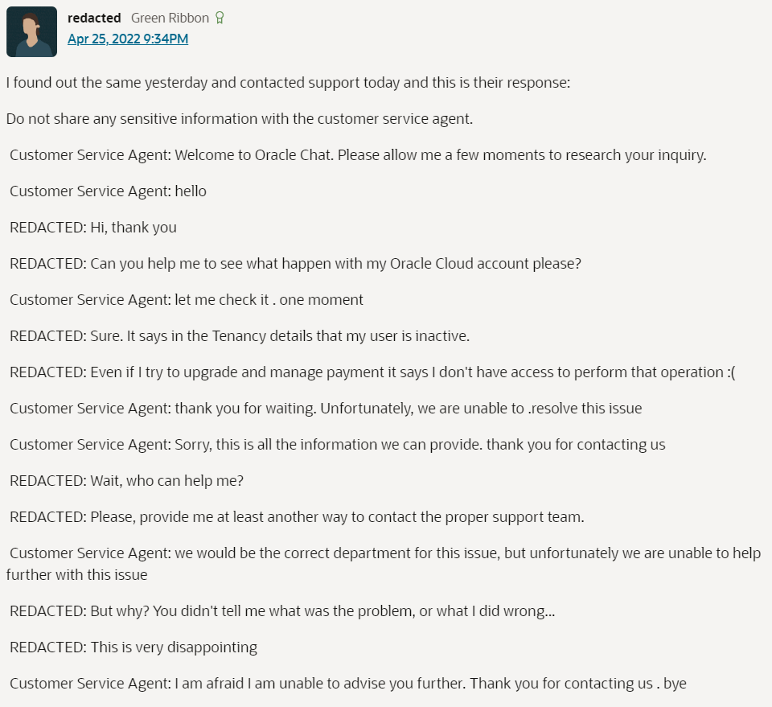
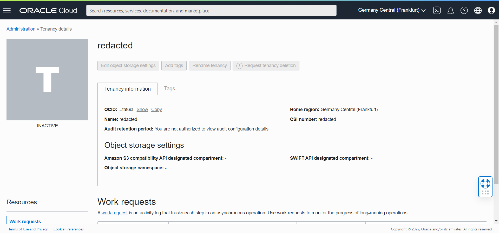

In Aug 1, 2022 9:38:10 PM UTC, I got multiple emails from Sentry. Turns out there was a problem about connecting to the database.


I immediately tried to connect my database using `mongosh`

```bash
$ mongosh "mongodb://<ip:port>"
Current Mongosh Log ID: 62e912234d9a6e5a02a45867
Connecting to:          mongodb://<credentials>@<ip:port>/<db>?directConnection=true&appName=mongosh+1.5.0
MongoServerSelectionError: connect ETIMEDOUT <ip:port>
```

Well, something was wrong.

I was using Oracle Cloud Infrastructure (OCI) for this project. It was great, it has generous always free resources and UI is so great for me (basic).

I thought that I knew what the problem is because 5 hours ago, I migrated database from Oracle Autonomous Database for Mongo API (OAD) to self hosted Mongo database.

---

## Migration

The reason for switch is OAD uses SQL behind and session limit is too low (I guess it's 20 session per 1 OCPU) and I was getting errors while using OAD about session limit
being reached.

In OCI, I wasn't used most of my always free resources for Compute instances. So I created the most powerful always free resource Ampere A1 instance with 24GBs of RAM and 4 OCPU.

I installed Docker in it and created a `mongo` container. I created admin user, set up ports and add ingress rule in VCN and it worked. I was able to connect to database
from `mongosh`.

For migration I used `mongodump` and `mongorestore`. It was approximately 25 min. process (database was huge `mongodump` archive was 1GB).

```bash
$ ls -l
-rwxrwx--- 1 batin batin 1G Aug  1 04:13 mongo_export.archive
```

And it worked... For 5 hours.

After dumping and restoring the database I changed some of database code and re-built the application. It was working, even faster. I committed changes and merged changes
to `main` branch.

I used the web app like 2-3 hours and go back to sleep (in Turkey, time was ~23:00).

---

## Inside OCI

Two hours later my phone rang... An email, from Sentry.

I get up, checked logs, tried to log in to database. After that, I logged in to OCI. Tried to check instance but an error popped up.



Looks like I didn't have permission to view a resource I created 5 hours ago. That's great. Since I am the administrator, I should contact myself for help, right?

I check the requests that OCI Client makes to server and saw that I get 404 error with this response.

```json
{
  "code": "NotAuthorizedOrNotFound",
  "message": "Authorization failed or requested resource not found."
}
```

I searched this error in search engine and saw that dozens of people also experienced this error. I logged in to Oracle Community (basically a support forum) and most of
the threads left unanswered.

Answered ones are basically something like this:

> Hello,
>
> Greetings of the day! Thank you for reaching out on Forum.
>
> We would like to check further with more details, hence I we have dropped you a private message, kindly respond over it.
>
> Thanks & regards!
>
> [Name of support]

So I didn't get any useful information there.

Even one member has shared it's customer support (which is not available for Always Free users).



After viewing some of threads, I checked my tenancy settings and saw that my tenancy became inactive.



---

## Terms of Service

After viewing more threads, I came across an answer says that 'You probably violated Terms of Service.'. That's weird. I didn't violate TOS.

I read [Terms of Service of OCI](https://www.oracle.com/assets/cloud-csa-v012418-sg-eng-4419911.pdf) and in 9.3 they are clearly state that
'we will provide you with advance notice of any such suspension.'. I didn't get a warning, none of us get a warning. It's just shut down.

I also thought about maybe it's forbidden to deploy Mongo inside a Compute instance.

Nope, Oracle has [multiple](https://docs.oracle.com/en/solutions/deploy-mongodb/index.html) [tutorials](https://developer.oracle.com/tutorials/deploy-mongodb-oci-linux-vm/)
about deploying Mongo inside a Compute instance.

I am sure I didn't violate Terms of Service.

---

Now, my application doesn't work and I get lot's of emails from different services such as GitHub Actions, Sentry and more... Also I am looking for
another cloud provider to host my database.

I actually liked OCI because it was easy and understandable. They had already covered everyting in their documentations and they were really helpful.

Well. I guess that's how Oracle works. After trial period ends they shut down random accounts that are using their '**Always Free (not for long)**' services.

---

## Q&A

Here are some questions I want to clarify:

---

**Q**: Why are you using free resources in production?

**A**: I am student, in Turkey. I know that my database costs ~10$ on MongoDB Atlas or other providers but ~10$/month is too much for me (TRY/USD = 0.056).

---

**Q**: Does your database contains illegal stuff?

**A**: Nope.

---

**Q**: Did you create a thread in Oracle Community forum?

**A**: Yes, no answers.

---
